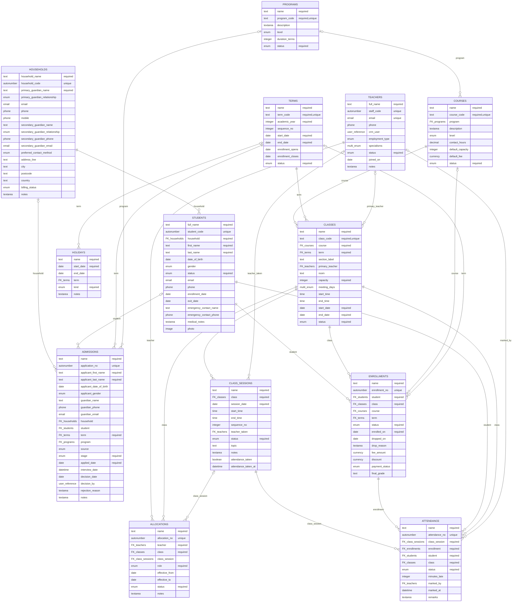

# Entity Relationship Diagram

<!-- GENERATED FILE -- do not edit. Source: schema/model.yaml (npm run gen:docs) -->

Crow's feet point at the many side. `o|` marks an optional reference.

## Reading the model

- **Household** (`households`) — Family or billing unit. In Zoho this rides on the stock Contacts module, so one record is "the household plus its primary guardian". The entity is kept distinct in this spec so a future move to Accounts-as-household is a mapping change, not a remodel.
- **Student** (`students`) — The learner. Always belongs to exactly one household.
- **Teacher** (`teachers`) — Teaching staff. A separate module rather than CRM users because the org holds only 2 user licences; crm_user links the minority who do have one.
- **Term** (`terms`) — An academic term/session. Classes and enrollments are scoped to one.
- **Holiday** (`holidays`) — A date or date range on which no lesson is held. Scoped to a term when it is a term-specific closure, or left unscoped to apply across the whole calendar -- which is what a public holiday needs.
- **Course** (`courses`) — What is taught. A course has no date and no teacher -- that is a `classes` row. The Zoho module name is forced by the target org: demo3 already holds an unrelated `Courses` (CustomModule2).
- **Admission** (`admissions`) — An application. Applicant details are held inline because no student row exists until the application is accepted; `student` is back-filled then.
- **Class** (`classes`) — A section/batch: course x term x weekly timetable. NOT a dated lesson -- that is `class_sessions`. Attendance never attaches here.
- **Class Session** (`class_sessions`) — A single dated meeting of a class, generated from the weekly pattern on `classes`. teacher_taken records who actually ran it, which may differ from the class primary_teacher (substitutions).
- **Enrollment** (`enrollments`) — Joins a student to a class. `course` and `term` are intentionally denormalized: Zoho COQL cannot join two hops, so "all enrollments in Term 1" is only answerable if the term sits on this record. Both are derived from `class` and kept in step by workflow (Zoho) / trigger (SQL).
- **Allocation** (`allocations`) — Teacher assigned to a class. class_session is NULL for a whole-term allocation and set only for a one-off substitution on that date.
- **Attendance** (`attendance`) — One mark per enrolled student per session. `student` and `class` are denormalized off the enrollment for the same COQL reason as enrollments. Highest-volume table: students x classes-each x sessions-per-term.
