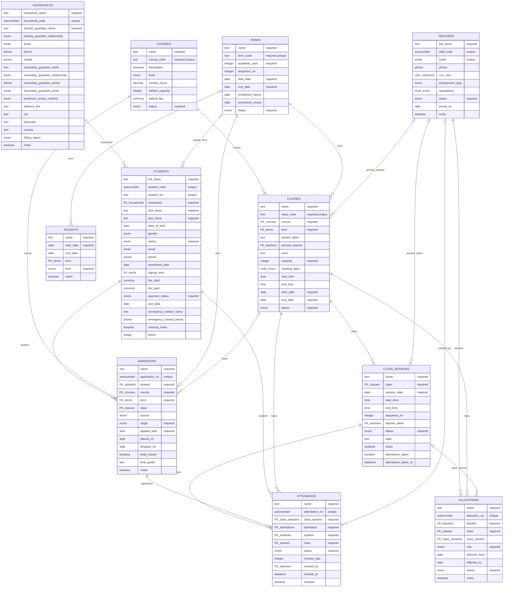

# Entity Relationship Diagram

<!-- GENERATED FILE -- do not edit. Source: schema/model.yaml (npm run gen:docs) -->

Crow's feet point at the many side. `o|` marks an optional reference.

```mermaid
erDiagram
    HOUSEHOLDS {
        text household_name "required"
        autonumber household_code "unique"
        text primary_guardian_name "required"
        enum primary_guardian_relationship
        email email
        phone phone
        phone mobile
        text secondary_guardian_name
        enum secondary_guardian_relationship
        phone secondary_guardian_phone
        email secondary_guardian_email
        enum preferred_contact_method
        text address_line
        text city
        text postcode
        text country
        enum billing_status
        textarea notes
    }
    STUDENTS {
        text full_name "required"
        autonumber student_code "unique"
        text student_ref "unique"
        FK_households household "required"
        text first_name "required"
        text last_name "required"
        date date_of_birth
        enum gender
        enum status "required"
        email email
        phone phone
        date enrollment_date
        FK_terms signup_term
        currency fee_total
        currency fee_paid
        enum payment_status "required"
        date exit_date
        text emergency_contact_name
        phone emergency_contact_phone
        textarea medical_notes
        image photo
    }
    TEACHERS {
        text full_name "required"
        autonumber staff_code "unique"
        email email "unique"
        phone phone
        user_reference crm_user
        enum employment_type
        multi_enum specialisms
        enum status "required"
        date joined_on
        textarea notes
    }
    TERMS {
        text name "required"
        text term_code "required,unique"
        integer academic_year "required"
        integer sequence_no
        date start_date "required"
        date end_date "required"
        date enrollment_opens
        date enrollment_closes
        enum status "required"
    }
    HOLIDAYS {
        text name "required"
        date start_date "required"
        date end_date
        FK_terms term
        enum kind "required"
        textarea notes
    }
    COURSES {
        text name "required"
        text course_code "required,unique"
        textarea description
        enum level
        decimal contact_hours
        integer default_capacity
        currency default_fee
        enum status "required"
    }
    ADMISSIONS {
        text name "required"
        autonumber application_no "unique"
        FK_students student "required"
        FK_courses course "required"
        FK_terms term "required"
        FK_classes class
        enum source
        enum stage "required"
        date applied_date "required"
        date placed_on
        date dropped_on
        textarea drop_reason
        text final_grade
        textarea notes
    }
    CLASSES {
        text name "required"
        text class_code "required,unique"
        FK_courses course "required"
        FK_terms term "required"
        text section_label
        FK_teachers primary_teacher
        text room
        integer capacity "required"
        multi_enum meeting_days
        time start_time
        time end_time
        date start_date "required"
        date end_date "required"
        enum status "required"
    }
    CLASS_SESSIONS {
        text name "required"
        FK_classes class "required"
        date session_date "required"
        time start_time
        time end_time
        integer sequence_no
        FK_teachers teacher_taken
        enum status "required"
        text topic
        textarea notes
        boolean attendance_taken
        datetime attendance_taken_at
    }
    ALLOCATIONS {
        text name "required"
        autonumber allocation_no "unique"
        FK_teachers teacher "required"
        FK_classes class "required"
        FK_class_sessions class_session
        enum role "required"
        date effective_from
        date effective_to
        enum status "required"
        textarea notes
    }
    ATTENDANCE {
        text name "required"
        autonumber attendance_no "unique"
        FK_class_sessions class_session "required"
        FK_admissions admission "required"
        FK_students student "required"
        FK_classes class "required"
        enum status "required"
        integer minutes_late
        FK_teachers marked_by
        datetime marked_at
        textarea remarks
    }

    HOUSEHOLDS ||--o{ STUDENTS : "household"
    TERMS |o--o{ STUDENTS : "signup_term"
    TERMS |o--o{ HOLIDAYS : "term"
    STUDENTS ||--o{ ADMISSIONS : "student"
    COURSES ||--o{ ADMISSIONS : "course"
    TERMS ||--o{ ADMISSIONS : "term"
    CLASSES |o--o{ ADMISSIONS : "class"
    COURSES ||--o{ CLASSES : "course"
    TERMS ||--o{ CLASSES : "term"
    TEACHERS |o--o{ CLASSES : "primary_teacher"
    CLASSES ||--o{ CLASS_SESSIONS : "class"
    TEACHERS |o--o{ CLASS_SESSIONS : "teacher_taken"
    TEACHERS ||--o{ ALLOCATIONS : "teacher"
    CLASSES ||--o{ ALLOCATIONS : "class"
    CLASS_SESSIONS |o--o{ ALLOCATIONS : "class_session"
    CLASS_SESSIONS ||--o{ ATTENDANCE : "class_session"
    ADMISSIONS ||--o{ ATTENDANCE : "admission"
    STUDENTS ||--o{ ATTENDANCE : "student"
    CLASSES ||--o{ ATTENDANCE : "class"
    TEACHERS |o--o{ ATTENDANCE : "marked_by"
```

## Reading the model

- **Household** (`households`) — Family or billing unit. In Zoho this rides on the stock Contacts module, so one record is "the household plus its primary guardian". The entity is kept distinct in this spec so a future move to Accounts-as-household is a mapping change, not a remodel.
- **Student** (`students`) — The learner. Always belongs to exactly one household.
- **Teacher** (`teachers`) — Teaching staff. A separate module rather than CRM users because the org holds only 2 user licences; crm_user links the minority who do have one.
- **Term** (`terms`) — An academic term/session. Classes and enrollments are scoped to one.
- **Holiday** (`holidays`) — A date or date range on which no lesson is held. Scoped to a term when it is a term-specific closure, or left unscoped to apply across the whole calendar -- which is what a public holiday needs.
- **Course** (`courses`) — What is taught. A course has no date and no teacher -- that is a `classes` row. The Zoho module name is forced by the target org: demo3 already holds an unrelated `Courses` (CustomModule2).
- **Admission** (`admissions`) — One student admitted to one course. Five courses chosen is five rows. This is the record a place in a class is made against, and it carries the class once the placement is made -- so one row is the whole life of "this person takes this subject": admitted, placed, marked, graded. It used to be an application made before any student existed, with the applicant's own name and guardian held inline. That is gone: a student signs up first (see students.signup_term and the fee fields on it), and only once the fee is settled is a row created here per course chosen. Holding applicant details here would have repeated one person's date of birth once per subject they take.
- **Class** (`classes`) — A section/batch: course x term x weekly timetable. NOT a dated lesson -- that is `class_sessions`. Attendance never attaches here.
- **Class Session** (`class_sessions`) — A single dated meeting of a class, generated from the weekly pattern on `classes`. teacher_taken records who actually ran it, which may differ from the class primary_teacher (substitutions).
- **Allocation** (`allocations`) — Teacher assigned to a class. class_session is NULL for a whole-term allocation and set only for a one-off substitution on that date.
- **Attendance** (`attendance`) — One mark per admitted student per session. `student` and `class` are denormalized off the admission for the same COQL reason admissions is. Highest-volume table: students x classes-each x sessions-per-term.
